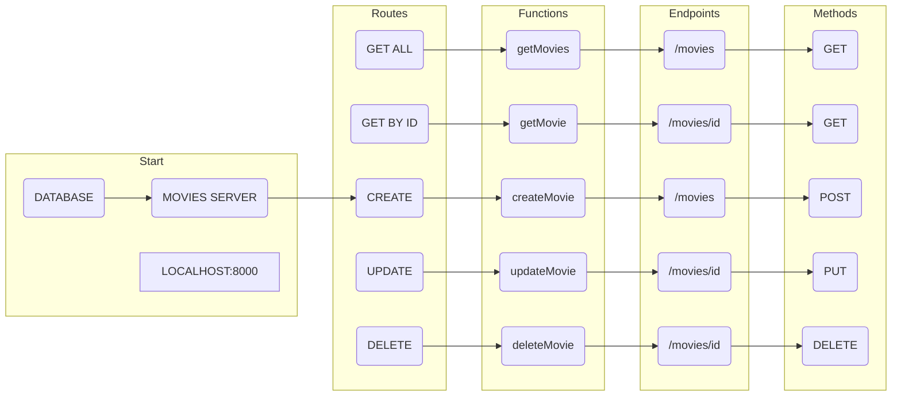

# go-crud-api

go crud API inspired by 11 projects in one free code camp tutorial https://www.youtube.com/watch?v=jFfo23yIWac

# flowchart from video (TBC - attempting to recreate with mermaid.js)

